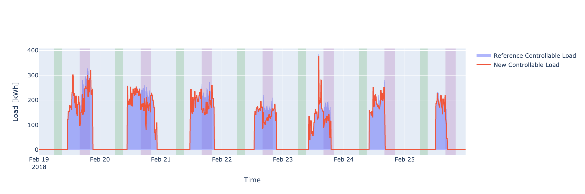

# Reinforcement Learning for Demand Response in Commercial Buildings

This repository contains the code and data used for the research paper **"Towards Sustainable Energy Use: Reinforcement Learning for Demand Response in Commercial Buildings"**, which explores reinforcement learning (RL) strategies for optimizing energy management in commercial buildings. All results reported in the paper are reproducible with this repository.

---

## Table of Contents
- [Overview](#overview)
- [Repository Structure](#repository-structure)
- [Datasets](#datasets)
- [Installation](#installation)
- [Usage](#usage)
- [Algorithms](#algorithms)
- [Results](#results)
- [Figures](#figures)
- [License](#license)

---

## Overview
The study proposes a framework to manage HVAC (discrete action spaces) and lighting systems (continuous action spaces) using state-of-the-art RL algorithms. The objective is to reduce electricity costs, CO2 emissions, and peak load while maintaining occupant comfort. It integrates real-world data and risk assessment metrics (VaR, CVaR) to optimize energy usage dynamically.

---

## Repository Structure

```plaintext
.
├── LICENSE                     # License file
├── data_preparation.ipynb      # Script to preprocess and generate datasets
├── report.ipynb                # Notebook for reproducing reported results
├── training.py                 # Main script to train RL models
├── hvac.py                     # HVAC system modeling
├── datasets/                   # Datasets used and generated in the study
│   ├── CA-QC_2023_hourly.csv
│   ├── HQRTLMP.csv
│   ├── temp.csv
│   └── ...
├── figures/                    # Figures generated for the paper
├── sacd.py                     # SACD algorithm implementation
├── ppo.py                      # PPO algorithm implementation
├── ppod.py                     # PPOD algorithm implementation
├── td3.py                      # TD3 algorithm implementation
├── d3qn.py                     # D3QN algorithm implementation
├── ddpg.py                     # DDPG algorithm implementation
└── results.py                  # Script to evaluate models and generate results
```


## Datasets
The repository includes real-world and synthetic data used in the research:
- **Source:** Canadian electricity markets and local weather data.
- **Files:** 
  - `CA-QC_2023_hourly.csv`: Hourly load data for Quebec.
  - `HQRTLMP.csv`: Historical electricity market prices.
  - `temp.csv`: Temperature data used for model training.
  - Preprocessed datasets (`df.pkl`, `ref_res.pkl`).

To regenerate datasets, use the notebook `data_preparation.ipynb`.

---

## Installation
1. Clone the repository:
   ```bash
   git clone https://github.com/srmadani/Demand-Response-in-Commercial-Buildings.git
   cd Demand-Response-in-Commercial-Buildings
   ```
2. Install dependencies:
   ```bash
   pip install -r requirements.txt
   ```
3. Ensure all datasets are correctly placed in the `datasets/` directory.

---

## Usage

### Preprocess Data
Run the `data_preparation.ipynb` notebook to preprocess datasets:
```bash
jupyter notebook data_preparation.ipynb
```

### Train Models
Use the `training.py` script to train RL models:
```bash
python training.py --algorithm <ALGORITHM_NAME> --config <CONFIG_FILE>
```
Available algorithms: `sacd`, `ppo`, `ppod`, `td3`, `d3qn`, `ddpg`.

### Generate Results
Run the `report.ipynb` notebook to reproduce paper results and generate figures:
```bash
jupyter notebook report.ipynb
```

---

## Algorithms
This study implements the following RL algorithms:
1. **Discrete Action Spaces:**
   - Soft Actor-Critic for Discrete actions (SACD)
   - Proximal Policy Optimization for Discrete actions (PPOD)
   - Double Dueling Deep Q-Network with Prioritized Experience Replay (D3QN)
2. **Continuous Action Spaces:**
   - Deep Deterministic Policy Gradient (DDPG)
   - Twin Delayed Deep Deterministic Policy Gradient (TD3)
   - Proximal Policy Optimization (PPO)

Each algorithm is tailored to optimize either HVAC (binary control) or lighting systems (continuous control).

---

## Results
The main findings include:
- Peak load reduction up to **27%** using PPOD & TD3.
- Electricity cost savings of **5.8%**.
- **4.9%** decrease in CO2 emissions.
- Maintained indoor temperature deviations within acceptable bounds.

Detailed performance comparisons and figures are available in the `report.ipynb` notebook.

---

## Figures
Here are some key visualizations from the study:

1. **Comparison of Reference and New Controllable Load:**
   

3. **Indoor and Outdoor Temperature Trends:**
   

2. **RL Methodology for Demand Response Optimization:**
   

---

## License
This project is licensed under the MIT License. See the [LICENSE](LICENSE) file for details.

---

For questions or issues, feel free to create an issue or contact the authors of the paper.
